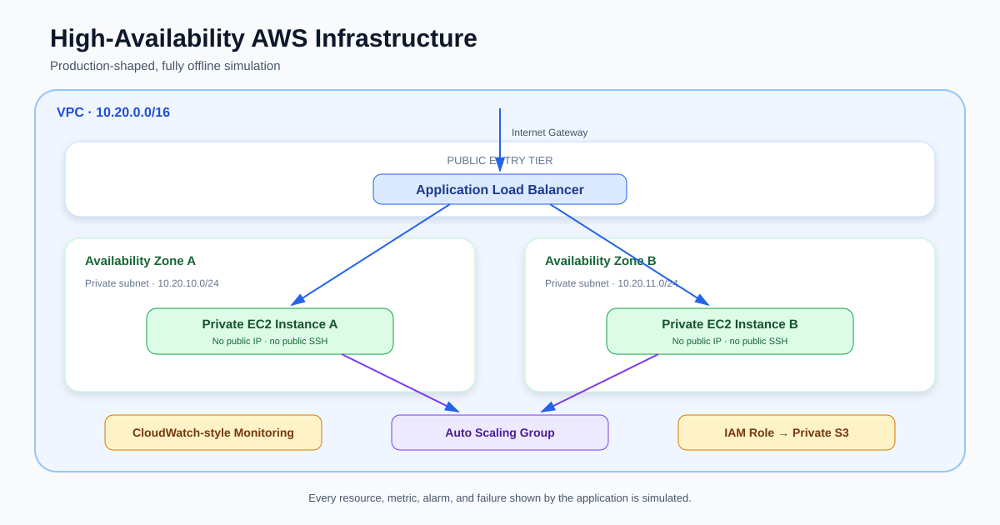

# High-Availability AWS Infrastructure Simulator

An interactive portfolio project that explains how a production-shaped AWS
environment routes traffic, scales capacity, detects failure, and recovers—without
creating cloud resources or requiring an AWS account.

> **Simulation only:** No AWS resources are created. No credentials, paid APIs,
> external models, or cloud services are required. All infrastructure state,
> telemetry, alarms, command output, and cost figures are simulated or educational.

## Project Overview

The High-Availability AWS Infrastructure Simulator turns a cloud architecture
diagram into an explorable system. Visitors can replay deterministic infrastructure
events, inspect resources, follow health checks and alarms, study matching Terraform
HCL, and understand the security and cost decisions behind the design.

The reference architecture represents an internet-facing application distributed
across two Availability Zones. An Application Load Balancer sends requests to
private EC2 instances managed by an Auto Scaling Group. Supporting resources model
least-privilege IAM access, encrypted S3 storage, and CloudWatch-style monitoring.

The public experience remains permanently affordable because Python models every
resource and transition locally. It never provisions the architecture it teaches.



## Key Features

- Production-shaped, multi-AZ AWS reference architecture
- Deterministic normal, failure, scaling, outage, and recovery scenarios
- Immutable timeline snapshots that can be replayed reliably
- Interactive Graphviz architecture with resource-level inspection
- Simulated CloudWatch metrics, alarms, alarm history, and recovery state
- Security review with trust-path visualization and misconfiguration examples
- Dated, static cost estimates with cost-reduction guidance
- Terraform Explorer covering every major simulated component
- Beginner explanations and practical interview tips
- Guided tour, responsive layout, and keyboard-visible controls
- Automated Ruff, pytest, offline-safety, and secret-pattern checks

## Architecture Overview

```text
Internet
   |
Internet Gateway
   |
Application Load Balancer
  /                         \
Public Subnet A          Public Subnet B
  |                         |
Target Group and ALB health checks
  |                         |
Private EC2 A            Private EC2 B
  \________ Auto Scaling Group ________/
              |                  |
     Least-Privilege IAM    CloudWatch-style
              |             metrics and alarms
       Private Encrypted S3
```

The VPC uses public and private subnets in `us-east-1a` and `us-east-1b`.
Only the ALB is represented as internet-facing. EC2 application instances remain
private and accept application traffic only through the ALB security group.

Read the detailed [architecture guide](docs/architecture.md).

## Technology Stack

| Area | Technology | Purpose |
|---|---|---|
| Interface | Streamlit | Interactive recruiter-facing web experience |
| Application | Python 3.12 | Models, scenarios, validation, and presentation |
| Modeling | Python dataclasses | Typed infrastructure state and immutable snapshots |
| Visualization | Graphviz/SVG | Architecture and security trust paths |
| IaC education | Terraform HCL | Display-only infrastructure examples |
| Testing | pytest and Streamlit AppTest | Unit, regression, UI, and safety coverage |
| Quality | Ruff | Fast linting and import/style validation |
| CI | GitHub Actions | Linux quality and offline-safety checks |

Runtime dependencies are intentionally limited to Streamlit and Graphviz.

## Simulator Features

The simulator supports four deterministic scenarios:

1. **Normal operation** — traffic is balanced between healthy instances in two AZs.
2. **EC2 instance failure** — health checks fail, the target is deregistered, and
   Auto Scaling launches and registers a replacement.
3. **Traffic spike** — CPU and request volume rise, an alarm activates, capacity
   scales out, and the fleet later scales in.
4. **Availability Zone outage** — one zone becomes unavailable, traffic fails over,
   capacity recovers in the healthy zone, and multi-AZ balance is restored.

Each event records a timestamp, event type, affected resource, explanation, and an
immutable state snapshot. See the [simulation model](docs/simulation-model.md).

## Terraform Explorer

The Terraform Explorer maps simulator resources to syntax-highlighted HCL for:

- VPC, Internet Gateway, route tables, and subnets
- Security groups, ALB, target group, and Auto Scaling Group
- Launch template and Auto Scaling-managed EC2 instances
- IAM role, private S3 bucket, and CloudWatch alarms

Every example explains important arguments, dependencies, security considerations,
and best practices. The lifecycle walkthrough covers `init`, `validate`, `fmt`,
`plan`, `apply`, and `destroy`, but **never executes them**. TFLint, Checkov, and
Trivy output is educational only.

## Monitoring

The Monitoring dashboard derives deterministic CloudWatch-style telemetry from the
selected timeline snapshot:

- CPU utilization
- Request rate
- Healthy host count
- Response time
- Active alarms and alarm transitions
- Recovery status

No metric is queried from AWS, and no background monitoring service runs.

## Security Review

The security experience explains VPC isolation, subnet separation, security-group
chaining, private compute, ALB-only ingress, least-privilege IAM, IMDSv2, no public
SSH, encrypted storage, and public-access blocking. It also shows common
misconfigurations and safer alternatives.

Read the full [security guide](docs/security.md).

## Cost Awareness

The cost panel provides dated educational examples for NAT Gateway, ALB, EC2, EBS,
CloudWatch, public IPv4, and data transfer. Values are static assumptions—not
quotes—and the interface explains which charges are variable or excluded.

The simulator itself creates **$0 in AWS charges**. See
[cost awareness](docs/cost-awareness.md).

## Educational Mode

Each major AWS component includes:

- What it is
- Why it exists in this architecture
- Recommended practices
- A practical interview discussion point

This lets beginners learn progressively while giving experienced visitors a quick
way to assess the project’s architectural reasoning.

## Guided Tour

Select **Start Guided Tour** to open the EC2 failure scenario. Move through the
timeline one event at a time to see the architecture, resource state, metrics,
alarms, and recovery explanation change together.

For a suggested recruiter walkthrough, see the
[recruiter guide](docs/recruiter-guide.md).

## Screenshots

Screenshots will be captured after deployment. Planned images:

| Screenshot | What it should demonstrate | Release status |
|---|---|---|
| Landing Page | Project value, offline notice, and entry actions | Capture after deployment |
| Simulator Dashboard | Scenario controls, status, topology, and timeline | Capture after deployment |
| Architecture View | Multi-AZ resource relationships and current health | Capture after deployment |
| Monitoring Dashboard | Metrics, alarms, history, and recovery status | Capture after deployment |
| Security Review | Trust path, controls, and misconfigurations | Capture after deployment |
| Cost Awareness | Static estimates and cost-conscious decisions | Capture after deployment |
| Terraform Explorer | Resource mapping and highlighted HCL | Capture after deployment |
| Guided Tour | A failure event with synchronized explanations | Capture after deployment |
| Mobile View | Usable stacked layout on a narrow viewport | Capture after deployment |

No screenshot files are included yet.

## Local Installation

Prerequisites:

- Python 3.12
- Git, if cloning from a repository
- A modern browser

No AWS CLI, AWS account, Terraform installation, or credentials are needed.

```bash
# After downloading or cloning the source:
cd high-availability-aws-infrastructure-simulator
python -m venv .venv
```

Activate the environment:

```bash
# Windows PowerShell
.venv\Scripts\Activate.ps1

# macOS or Linux
source .venv/bin/activate
```

Install runtime dependencies:

```bash
python -m pip install --upgrade pip
python -m pip install -r requirements.txt
```

## Running the Project

```bash
python -m streamlit run app.py
```

Open the address printed by Streamlit, normally `http://localhost:8501`, then select
**Open Simulator** or **Start Guided Tour**.

## Running Tests

Install development dependencies and run the complete quality gate:

```bash
python -m pip install -r requirements.txt -r requirements-dev.txt
python -m ruff check app.py src tests
python -m pytest -p no:cacheprovider -q
```

The suite covers architecture invariants, scenario regressions, deterministic
replay, UI behavior, responsive styling, security controls, Terraform education,
secret patterns, and offline operation.

The complete display-only HCL artifact is documented in the
[Terraform example guide](terraform/README.md).

## Project Structure

```text
.
├── app.py                         # Streamlit entry point
├── src/
│   ├── architecture.py            # Reference architecture factory
│   ├── models.py                  # Typed AWS resource/state models
│   ├── validation.py              # Architecture and security invariants
│   ├── simulation.py              # Deterministic transition engine
│   ├── scenarios.py               # Stable scenario catalog
│   ├── monitoring.py              # Derived simulated telemetry
│   ├── education.py               # Component and security guidance
│   ├── cost_data.py               # Static educational cost assumptions
│   ├── terraform_explorer.py      # HCL and lifecycle learning content
│   └── ui.py                      # Streamlit presentation layer
├── tests/                         # Unit, regression, UI, and safety tests
├── terraform/                     # Educational Terraform project examples
├── docs/                          # Detailed project documentation
├── assets/                        # Static visual assets
└── .github/workflows/quality.yml  # Offline quality workflow
```

## Design Decisions

- **Simulation instead of permanent AWS resources:** keeps the portfolio available
  without cloud charges, credentials, or operational maintenance.
- **Deterministic events:** makes demonstrations repeatable and tests reliable.
- **Immutable snapshots:** prevents earlier timeline states from changing during
  replay.
- **Provider-free HCL display:** teaches Terraform relationships without creating an
  execution path.
- **Private application tier:** demonstrates defense in depth and ALB-only ingress.
- **Static, dated cost data:** communicates cost drivers without a pricing API.
- **Small dependency footprint:** reduces startup time and supply-chain surface.
- **Clear disclosure:** prevents simulated metrics or output from being mistaken for
  a live AWS environment.

## Limitations

- The simulator does not create, validate, plan, apply, or destroy infrastructure.
- Metrics approximate operational behavior; they are not CloudWatch telemetry.
- Cost examples are not current AWS quotes and exclude several variable charges.
- HCL snippets teach key resources but are not a complete production deployment.
- The model intentionally simplifies DNS, TLS, NAT, databases, queues, WAF, backups,
  logging pipelines, and organizational account controls.
- Browser responsiveness is tested through UI behavior and CSS checks; it is not a
  substitute for testing every device and assistive technology.

## Why This Project Exists

High-availability cloud projects are expensive to keep online and difficult for a
recruiter to inspect safely. Static diagrams show structure but not behavior. This
project closes that gap: it demonstrates architecture judgment, failure recovery,
Terraform knowledge, security thinking, cost awareness, automation, and testing in
one free, interactive experience.

## Future Improvements

- Capture and add production screenshots after deployment
- Add shareable deep links to specific scenarios and timeline events
- Add optional reduced-motion and high-contrast preferences
- Expand simulations for RDS Multi-AZ, Route 53, WAF, queues, and backup recovery
- Add downloadable scenario reports
- Add localized educational content
- Validate documentation links and accessibility in CI

Future work will preserve the project’s offline, no-credentials, no-AWS-cost model.

## License

Released under the [MIT License](LICENSE).

Copyright © 2026 Promise Ibeh.
